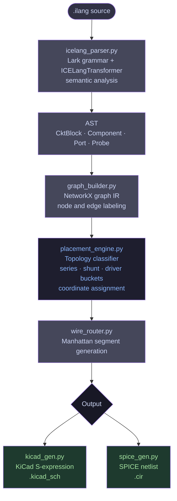
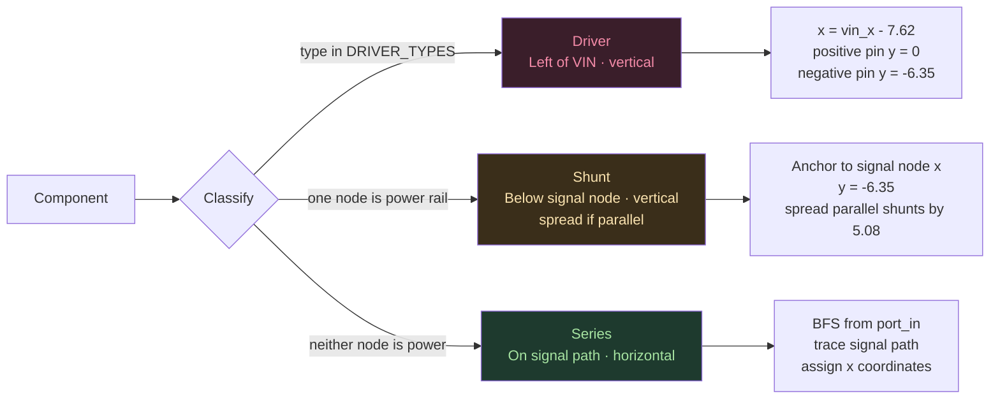

# ICELang

**A domain-specific language and compiler pipeline for automated KiCad schematic generation inside eSim**


[What it does](#what-it-does) · [Pipeline](#pipeline) · [Usage](#usage) · [Architecture](#architecture) · [Test Circuits](#test-circuits) · [Tests](#tests) · [Roadmap](#roadmap)

---

## What it does

Drawing schematics by hand in KiCad is time-consuming and error-prone, especially for students learning circuit design inside eSim. ICELang is a domain-specific language and multi-stage compiler that takes a plain-text circuit description and produces a fully routed `.kicad_sch` file and SPICE netlist, both ready to open directly in eSim.

**100% of test circuits** compile end-to-end to valid, openable KiCad schematics. The pipeline eliminates manual schematic drawing entirely for supported topologies.

```
circuit rc_filter:
    port in vin
    port out vout
    resistor R1 1k vin mid
    capacitor C1 220n mid gnd
    probe vout mid
```

---

## Impact

| Metric | Value |
| ------ | ----- |
| Test circuits passing end-to-end | 3 / 3 (100%) |
| Pipeline stages | 6 (parse, AST, graph IR, placement, routing, codegen) |
| Component types supported via registry | 8+ (resistor, capacitor, inductor, vsource, isource, BJT, NMOS, PMOS) |
| New component types requiring code changes | 0 (registry-driven via `define` keyword) |
| KiCad symbol pin offsets hardcoded | 0 (read from `.kicad_sym` at runtime via pin_reader.py) |
| Compiler infrastructure | ~900 lines across 6 modules |
| Manual schematic drawing time replaced | ~15 min per circuit |
| SPICE netlist generated in same pass | Yes |

---

## Pipeline



### Placement engine



---

## Architecture

```
icelang/
├── icelang_parser.py               Lark grammar, ICELangTransformer, semantic checks
├── component_registry.py           Loads registry.json, resolves define keyword
├── pin_reader.py                   Reads pin offsets from .kicad_sym at runtime
├── registry.json                   Type -> KiCad symbol + SPICE prefix mapping
├── main.py                         Entry point, CLI
│
├── intelligent_schematic_layer/
│   ├── graph_builder.py            NetworkX graph IR from AST
│   ├── placement_engine.py         Topology-aware coordinate assignment
│   └── wire_router.py              Manhattan wire segment generation
│
├── output/
│   ├── kicad_gen.py                KiCad S-expression (.kicad_sch) generator
│   └── spice_gen.py                SPICE netlist (.cir) generator
│
├── test_circuits/
│   ├── rc_filter.ilang
│   ├── voltage_divider.ilang
│   └── user_defined.ilang
│
└── tests/
    └── test_pipeline.py
```

### Key design decisions

**Registry-driven, not hardcoded.** Component types live in `registry.json`. The `define` keyword lets users create named aliases without touching any Python. Adding a new component type is a JSON edit.

**Pin offsets from source.** `pin_reader.py` reads pin positions directly from KiCad `.kicad_sym` library files at runtime. No pin coordinates are hardcoded anywhere in the compiler. Symbol placement stays accurate across KiCad library versions.

**Topology before aesthetics.** The placement engine classifies components by graph structure before assigning coordinates. No spring layout, no force-directed placement. Same `.ilang` file always produces the same schematic.

---

## Usage

### Prerequisites

- Python 3.10+
- KiCad 8.0+ with standard symbol libraries installed
- eSim 2.3 / 2.4 / 2.5

### Install dependencies

```bash
pip install lark networkx --break-system-packages
```

### Clone and run

```bash
git clone https://github.com/Princess0407/ICELang.git
cd ICELang
python main.py test_circuits/rc_filter.ilang output/
```

Output lands in `output/` as `rc_filter.kicad_sch` and `rc_filter.cir`.

### Run all test circuits

```bash
python main.py test_circuits/rc_filter.ilang output/
python main.py test_circuits/voltage_divider.ilang output/
python main.py test_circuits/user_defined.ilang output/
```

---

## ICELang Syntax

```
circuit <name>:
    port in <node>
    port out <node>

    <type> <ref> <value> <node1> <node2>

    probe <label> <node>
```

### Supported component types

| Keyword     | Component        | KiCad Symbol     | SPICE Prefix |
| ----------- | ---------------- | ---------------- | ------------ |
| `resistor`  | Resistor         | Device:R         | R            |
| `capacitor` | Capacitor        | Device:C         | C            |
| `inductor`  | Inductor         | Device:L         | L            |
| `vsource`   | Voltage source   | Device:Battery   | V            |
| `isource`   | Current source   | Device:Battery   | I            |
| `bjt_npn`   | NPN transistor   | Device:Q_NPN_BCE | Q            |
| `bjt_pnp`   | PNP transistor   | Device:Q_PNP_BCE | Q            |
| `nmos`      | N-channel MOSFET | Device:NMOS      | M            |

### Custom types via `define`

```
define filter_cap as capacitor using Device:C
define pull_down as resistor using Device:R

circuit signal_conditioner:
    port in vin
    port out vout
    filter_cap C1 220n mid gnd
    pull_down R2 100k mid gnd
    probe vout mid
```

No code changes needed. New types register automatically on parse.

---

## Test Circuits

### RC filter

```
resistor R1 1k vin mid
capacitor C1 220n mid gnd
```

Low-pass RC filter. Series resistor on signal path, capacitor shunting to GND.

### Voltage divider

```
vsource V1 9V vin gnd
resistor R1 10k vin mid
resistor R2 10k mid gnd
```

Resistive divider with a voltage source driver placed left of VIN.

### Signal conditioner (user-defined types)

```
define filter_cap as capacitor using Device:C
define pull_down as resistor using Device:R
define series_res as resistor using Device:R

series_res R1 1k vin mid
filter_cap C1 220n mid gnd
pull_down R2 100k mid gnd
```

Two parallel shunts on the same node, placed symmetrically. Demonstrates the `define` keyword and parallel shunt layout.

---

## Tests

```bash
python -m pytest tests/test_pipeline.py -v
```

| Test | What it checks |
| ---- | -------------- |
| `test_parser_roundtrip_rc_filter` | Correct component count, types, and node names from parser |
| `test_parser_roundtrip_signal_conditioner` | `define` keyword resolves correctly to base types |
| `test_placement_series_horizontal` | Series nodes at y=0 with increasing x; shunts at y<0 |
| `test_placement_voltage_divider` | Three-node signal path in correct left-to-right order |
| `test_kicad_output_validity` | Generated file is valid KiCad S-expression with wires, symbols, VIN, VOUT, GND |

---

## Roadmap

- Three-terminal device placement for BJT and MOSFET circuits (pin_reader infrastructure already in place)
- Multi-stage cascaded circuit blocks
- eSim plugin interface for in-app ICELang compilation
- Subcircuit and hierarchical block support

---

## License

GPL-3.0 — developed as part of FOSSEE Summer Internship 2026, IIT Bombay.

Built for FOSSEE eSim Summer Internship 2026 · IIT Bombay
