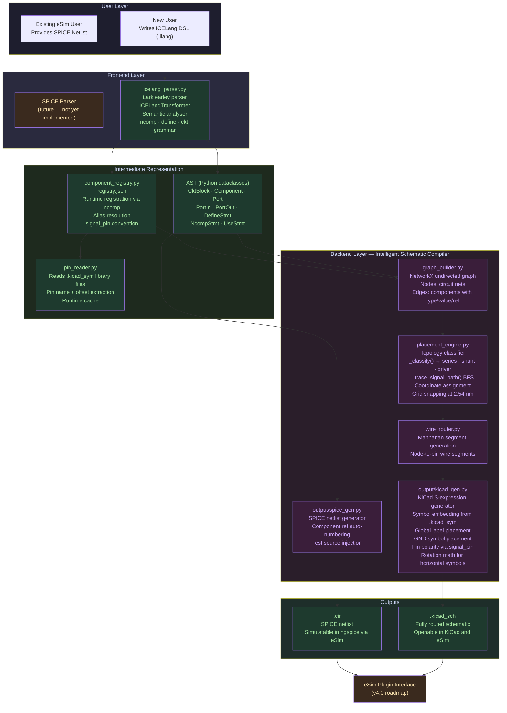
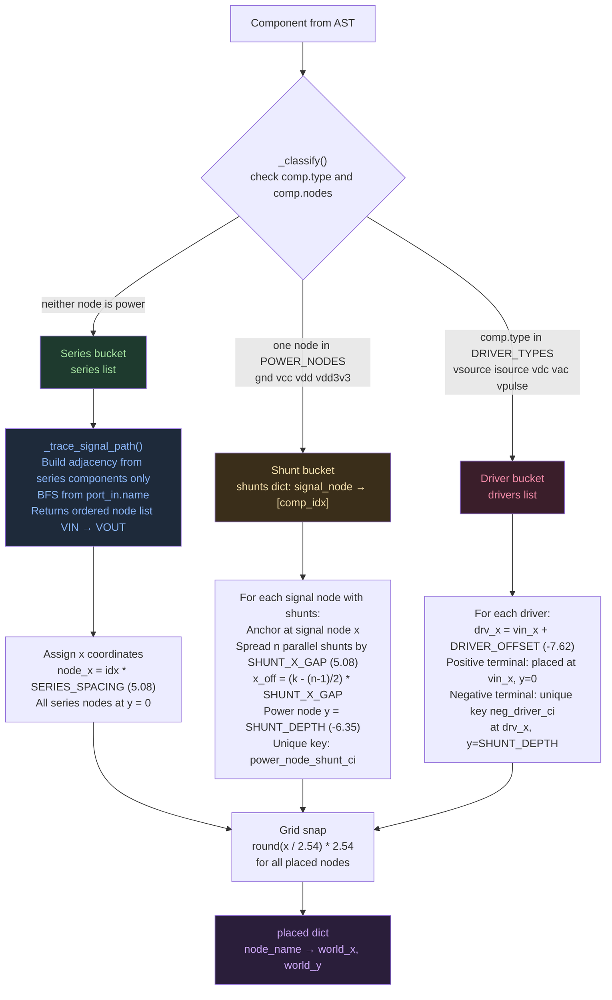
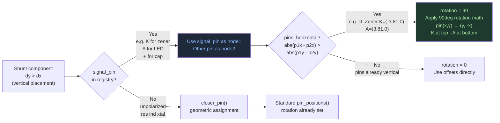

# ICELang

**A domain-specific language and multi-stage compiler pipeline for automated KiCad schematic generation and SPICE netlist export inside eSim**


[Overview](#overview) · [Versions](#versions) · [Architecture](#architecture) · [Pipeline](#pipeline) · [Syntax](#syntax) · [Component Registry](#component-registry) · [Test Circuits](#test-circuits) · [Plugin Roadmap](#kicad-plugin-roadmap) · [Tests](#tests)

---

## Overview

ICELang is a compiler that takes a plain-text circuit description written in a purpose-built DSL and produces two artifacts in a single pass:

- A fully routed `.kicad_sch` file with correct component placement, wire routing, port labels, and GND symbols, ready to open in KiCad or eSim
- A SPICE netlist (`.cir`) for simulation

The compiler has six stages: lexing and parsing via Lark, AST construction, graph IR via NetworkX, topology-aware placement, Manhattan wire routing, and S-expression code generation. No manual schematic drawing. No hardcoded coordinates. No code changes required to add new component types.

**100% of test circuits** compile end-to-end to valid, openable KiCad schematics across v2.2 and v3.0.

---

## Versions

ICELang has gone through two major iterations documented here. This repository contains v3.0 (current). The v1.0 tag contains the original hardcoded implementation for reference.

### v2.2 — Stable two-terminal pipeline

v2.2 is the first version that produces clean, correct KiCad schematics end-to-end. It introduced the topology-aware placement engine that replaced spring-layout and force-directed approaches entirely.

**What works in v2.2:**

- RC filter, voltage divider, and signal conditioner compile to clean schematics
- Topology-aware placement: series components on a horizontal signal path, shunt components below their signal node, driver sources left of VIN
- `define` keyword for user-defined component type aliases
- Pin offsets read from KiCad `.kicad_sym` library files at runtime via `pin_reader.py`
- Registry-driven lookup via `registry.json` — adding a component type is a JSON edit, not a code change
- SPICE netlist generated in the same compiler pass

**v2.2 syntax:**

```
ckt rc_filter:
    port_in: Vin
    port_out: Vout mid
    res Vin mid 1k
    cap mid gnd 220n
done
```

**What v2.2 does not handle:**

- Any KiCad symbol not already in `registry.json` requires a manual JSON edit
- No pin polarity convention — shunt component orientation (which pin faces the signal node) is determined by geometry, not semantics
- Components registered via `define` inherit the base type's pin order, which may be wrong for polarized components

**v2.2 schematic output — RC filter:**

> `[screenshot: docs/v2_rc_filter.png]`

**v2.2 schematic output — signal conditioner:**

> `[screenshot: docs/v2_signal_conditioner.png]`

---

### v3.0 — General-purpose two-terminal language (current)

v3.0 introduces `ncomp`, a runtime component registration instruction that makes ICELang a genuinely general-purpose language for any two-terminal KiCad Device library symbol. It also introduces a pin polarity convention system that correctly orients polarized components (diodes, zeners, LEDs, electrolytic caps) without any hardcoded component-specific logic.

**What changed from v2.2 to v3.0:**

| Area | v2.2 | v3.0 |
| ---- | ---- | ---- |
| Adding new component types | Edit `registry.json` manually | `ncomp` instruction in the `.ilang` file |
| Pin polarity for shunt components | Geometric closest-pin heuristic | `signal_pin` field in registry + rotation math |
| Symbol orientation | `rotation = 90 if dx > dy else 0` | Detects horizontal vs vertical pin layout, rotates accordingly |
| Component coverage | Fixed registry only | Any symbol in KiCad `Device` library |
| `ncomp` pin inference | N/A | Reads pin names from `.kicad_sym` at parse time, infers `signal_pin` from pin name conventions (K, A, +/-) |

**v3.0 syntax — `ncomp`:**

```
ckt zener_clamp:
    ncomp zen: D_Zener
    port_in: Vin
    port_out: Vout mid
    res Vin mid 1k
    zen mid gnd 5V1
done
```

`ncomp zen: D_Zener` does the following at parse time:
1. Looks up `Device:D_Zener` in the installed KiCad symbol library
2. Reads pin names and offsets via `pin_reader.py`
3. Verifies pin count is exactly 2 (enforces two-terminal constraint)
4. Infers `signal_pin` from pin names: `K` present → cathode-to-signal (clamp convention); `A` only → anode-to-signal (forward bias convention); `+` present → positive terminal to signal
5. Writes the full entry to `registry.json` and the in-memory registry cache
6. From that point in the parse, `zen` is a valid component type identical to any built-in type

**v3.0 schematic output — zener clamp:**

> `[screenshot: docs/v3_zener_clamp.png]`

**v3.0 schematic output — RC filter (unchanged from v2.2):**

> `[screenshot: docs/v3_rc_filter.png]`

---

## Architecture

### System overview

The architecture has two user entry points (existing eSim users providing SPICE netlists, and new users writing ICELang DSL), a frontend parsing layer, a shared intermediate representation, a backend compiler layer, and two output paths. The diagram below reflects the current v3.0 state.



### Placement engine detail



### Pin polarity and rotation system (v3.0)



---

## Pipeline

Stage-by-stage walkthrough of what happens when you run `python main.py test_circuits/rc_filter.ilang output/`.

**Stage 1 — Lexing and parsing (`icelang_parser.py`)**

Lark tokenizes the `.ilang` source using an earley parser. The grammar handles five statement types: `port_in_decl`, `port_out_decl`, `component_stmt`, `define_stmt`, `ncomp_stmt`, and `use_stmt`. `ncomp_stmt` triggers a side effect at parse time: it calls `pin_reader.get_pin_offsets()` against the installed KiCad library, infers `signal_pin`, and calls `component_registry.register()` before the rest of the file is transformed. This makes the registered type available to subsequent `component_stmt` lookups in the same file.

**Stage 2 — AST construction (`ICELangTransformer`)**

The Lark transformer converts parse tree nodes to typed Python dataclasses. `CktBlock` holds the full circuit. `Component` holds type, nodes list, value, and pin mapping. `NcompStmt` holds the registered name, KiCad symbol ID, inferred SPICE prefix, and pin names. Semantic analysis runs after transform: checks for GND presence, floating nodes, missing port_out node, empty circuit.

**Stage 3 — Graph IR (`graph_builder.py`)**

Builds a NetworkX undirected graph from the component list. Each circuit net becomes a node with a `node_type` attribute (`port_in`, `port_out`, `ground`, `internal`, `signal`). Each component becomes an edge with `component`, `value`, and `ref` attributes. Components with fewer than 2 nodes are skipped. This graph is passed to the placement engine.

**Stage 4 — Placement (`placement_engine.py`)**

`_classify()` partitions components into three buckets: drivers (voltage/current sources), shunts (one node is a power rail), and series (neither node is a power rail). `_trace_signal_path()` does a BFS through series-only adjacency from `port_in.name` to produce an ordered node list. Coordinates are assigned deterministically: series nodes at `y=0` spaced `5.08` apart, shunt power nodes at `y=-6.35` below their signal node, driver negative terminals at `x=vin_x-7.62`. All coordinates are snapped to the `2.54mm` KiCad grid. Returns a flat `placed` dict mapping node names to `(world_x, world_y)`.

**Stage 5 — Wire routing (`wire_router.py`)**

Generates Manhattan wire segments from node positions to component pin positions. Each two-terminal component's midpoint is the symbol center. Pin positions are computed from the symbol's KiCad offset data. The `closer_pin()` function assigns each node to the geometrically nearer pin. For polarized shunt components, `signal_pin` overrides geometry. All segments are deduplicated before emission.

**Stage 6 — Code generation (`output/kicad_gen.py`, `output/spice_gen.py`)**

`kicad_gen.py` builds a KiCad S-expression string. It embeds symbol definitions from the installed `.kicad_sym` library files, places component symbols at computed coordinates, draws wires, places GND power symbols at all shunt power node positions, and places VIN/VOUT global labels connected to the signal path endpoints. `spice_gen.py` generates a SPICE netlist with auto-numbered component references and an injected test voltage source on `port_in`.

---

## File Structure

```
icelang/
├── icelang_parser.py               Lark grammar, ICELangTransformer, NcompStmt,
│                                   DefineStmt, semantic analysis, analyse()
├── component_registry.py           load(), lookup(), register() with signal_pin support
├── pin_reader.py                   get_pin_offsets() — reads .kicad_sym at runtime,
│                                   caches results, returns {pin_name: (x, y)}
├── registry.json                   Canonical component registry. Each entry:
│                                   kicad_symbol, spice_prefix, pin_count,
│                                   pin_names, aliases, signal_pin (optional)
├── main.py                         CLI entry point: parse → build → place → route → write
│
├── intelligent_schematic_layer/
│   ├── graph_builder.py            build(ckt) → nx.Graph
│   ├── placement_engine.py         _classify(), _trace_signal_path(), place() → dict
│   └── wire_router.py              route(placed, edges) → wire segments
│
├── output/
│   ├── kicad_gen.py                generate(ckt, placed, routing) → KiCad S-expression
│   │                               _place_two_terminal(), _global_label(),
│   │                               _gnd_symbol(), pin polarity + rotation logic
│   └── spice_gen.py                generate(ckt) → SPICE netlist string
│
├── test_circuits/
│   ├── rc_filter.ilang             Series R + shunt C
│   ├── voltage_divider.ilang       Driver V + two series R
│   ├── user_defined.ilang          define keyword — custom type aliases
│   └── zener_clamp.ilang           ncomp keyword — runtime symbol registration
│
└── tests/
    └── test_pipeline.py            5 pytest tests covering parser, placement, output
```

---

## Syntax

### Full grammar reference

```
# Circuit block
ckt <name>:
    port_in:  <node_name>
    port_out: <label> <node_name>

    # Built-in or registered component
    <type> <node1> <node2> <value>

    # Register a KiCad Device library symbol at parse time (v3.0)
    ncomp <name>: <KiCadSymbolName>

    # Define a named alias for an existing type (v2.2)
    define <name> kicad="<Library:Symbol>" spice=<prefix> pins=<n>

    # Subcircuit instantiation (future)
    use <circuit_name> <node1> <node2>
done
```

### Component statement

```
<type> <node1> <node2> <value>
```

`node1` and `node2` are net names. `value` is the component value string (e.g. `1k`, `220n`, `9V`). The compiler auto-numbers references (`R1`, `R2`, `C1`, etc.) — you do not specify them.

### `ncomp` instruction (v3.0)

```
ncomp <user_name>: <KiCadDeviceSymbol>
```

Looks up `Device:<KiCadDeviceSymbol>` in the installed KiCad symbol library. Verifies it has exactly 2 pins. Infers `signal_pin` from pin names. Registers the type for use in the same circuit block. Writes the entry to `registry.json` for persistence across runs.

Examples:
```
ncomp zen:      D_Zener       # registered as Device:D_Zener, signal_pin=K
ncomp led:      LED           # registered as Device:LED, signal_pin=A
ncomp schottky: D_Schottky    # registered as Device:D_Schottky, signal_pin=K
ncomp tvs:      D_TVS         # registered as Device:D_TVS, signal_pin=K
ncomp xtal:     Crystal       # registered as Device:Crystal, no signal_pin (unpolarized)
```

### `define` instruction (v2.2)

```
define <name> kicad="<Library:Symbol>" spice=<prefix> pins=<n>
```

Creates a named alias for any KiCad symbol. Unlike `ncomp`, requires the full library path and explicit pin count. Use `ncomp` for Device library symbols. Use `define` for symbols in other libraries (e.g. `74xx`, `Amplifier_Operational`).

---

## Component Registry

### Registry entry structure

Each entry in `registry.json`:

```json
{
  "res": {
    "kicad_symbol": "Device:R",
    "spice_prefix": "R",
    "pin_count": 2,
    "pin_names": ["1", "2"],
    "aliases": ["resistor", "r"],
    "signal_pin": null
  }
}
```

| Field | Type | Description |
| ----- | ---- | ----------- |
| `kicad_symbol` | string | Full KiCad symbol ID `Library:SymbolName` |
| `spice_prefix` | string | SPICE element prefix (`R`, `C`, `L`, `D`, `Q`, `M`, `V`, `I`) |
| `pin_count` | int | Total number of pins |
| `pin_names` | list | Pin names in order, matching KiCad library |
| `aliases` | list | Alternative names that resolve to this entry |
| `signal_pin` | string or null | Pin name that connects to signal node for polarized components |

### Pin polarity convention

`signal_pin` encodes which pin faces the signal node when a component is used as a shunt (one node connects to GND or another power rail). The convention covers the following cases:

| Component class | `signal_pin` | Rationale |
| --------------- | ------------ | --------- |
| Resistor, inductor, crystal | null | Unpolarized, either pin works |
| Capacitor (numbered pins) | null | KiCad `Device:C` pins `1` and `2` are symmetric |
| Standard diode (forward bias) | `A` | Anode connects to signal, cathode to GND |
| LED | `A` | Same as diode |
| Zener (reverse clamp) | `K` | Cathode to signal, anode to GND for reverse breakdown |
| Schottky clamp | `K` | Same as zener |
| TVS diode | `K` | Same as zener |
| Voltage/current source | `+` | Positive terminal to signal rail |

When `signal_pin` is set and the component is placed as a shunt, the rotation system checks whether the symbol's pins are laid out horizontally in the KiCad library (as they are for `D_Zener`: `K` at `(-3.81, 0)`, `A` at `(3.81, 0)`). If horizontal, it applies a 90-degree rotation using the transform `pin(x, y) → (y, -x)`, placing `K` at the top (signal side) and `A` at the bottom (GND side).

### Built-in registry

| Name | KiCad Symbol | SPICE | Pins | signal_pin | Aliases |
| ---- | ------------ | ----- | ---- | ---------- | ------- |
| `res` | `Device:R` | R | 2 | — | resistor, r |
| `cap` | `Device:C` | C | 2 | — | capacitor, c |
| `ind` | `Device:L` | L | 2 | — | inductor, coil |
| `diode` | `Device:D` | D | 2 | A | d |
| `led` | `Device:LED` | D | 2 | A | LED |
| `zener` | `Device:D_Zener` | D | 2 | K | zener_diode |
| `xtal` | `Device:Crystal` | Y | 2 | — | crystal, oscillator |
| `vol` | `Device:Battery` | V | 2 | + | voltage, vsource, vdc |
| `curr` | `Device:Battery` | I | 2 | + | current, isource |
| `bjt_npn` | `Device:Q_NPN` | Q | 3 | — | npn, BC547, 2N2222 |
| `bjt_pnp` | `Device:Q_PNP` | Q | 3 | — | pnp, BC557 |
| `nmos` | `Device:Q_NMOS` | M | 4 | — | mosfet_n, nfet |
| `pmos` | `Device:Q_PMOS` | M | 4 | — | mosfet_p, pfet |
| `jfet_n` | `Device:Q_NJFET_GSD` | J | 3 | — | njfet, 2N5457 |
| `opamp` | `Amplifier_Operational:LM741` | X | 5 | — | LM741, LM358, TL071 |

---

## Test Circuits

### RC filter (`test_circuits/rc_filter.ilang`)

```
ckt rc_filter:
    port_in: Vin
    port_out: Vout mid
    res Vin mid 1k
    cap mid gnd 220n
done
```

Low-pass RC filter. `res` is series on the signal path. `cap` is a shunt below the `mid` node. Verifies: series placement, single shunt, GND symbol, VIN/VOUT labels.

> `[screenshot: docs/rc_filter.png]`

---

### Voltage divider (`test_circuits/voltage_divider.ilang`)

```
ckt voltage_divider:
    port_in: Vin
    port_out: Vout mid
    vol Vin gnd 9V
    res Vin mid 10k
    res mid gnd 10k
done
```

Driver source left of VIN, two series resistors on the signal path, second resistor shunts to GND. Verifies: driver placement, two-node series path, shunt on final node.

> `[screenshot: docs/voltage_divider.png]`

---

### Signal conditioner with `define` (`test_circuits/user_defined.ilang`)

```
ckt signal_conditioner:
    define filter_cap kicad="Device:C" spice=C pins=2
    define pull_down  kicad="Device:R" spice=R pins=2
    define series_res kicad="Device:R" spice=R pins=2
    port_in: Vin
    port_out: Vout mid
    series_res Vin mid 1k
    filter_cap mid gnd 220n
    pull_down  mid gnd 100k
done
```

Two parallel shunts on the same signal node. Verifies: `define` keyword type resolution, parallel shunt symmetric placement.

> `[screenshot: docs/signal_conditioner.png]`

---

### Zener clamp with `ncomp` (`test_circuits/zener_clamp.ilang`)

```
ckt zener_clamp:
    ncomp zen: D_Zener
    port_in: Vin
    port_out: Vout mid
    res Vin mid 1k
    zen mid gnd 5V1
done
```

Runtime symbol registration. `D_Zener` is looked up in the KiCad library at parse time, pins `K` and `A` are read, `signal_pin=K` is inferred, and the symbol is rotated 90 degrees for correct vertical placement with cathode at top. Verifies: `ncomp` registration, pin polarity convention, horizontal-to-vertical rotation math.

> `[screenshot: docs/zener_clamp.png]`

---

## Impact

| Metric | Value |
| ------ | ----- |
| Test circuits passing end-to-end | 4 / 4 (100%) |
| Pipeline stages | 6 |
| Component types in built-in registry | 15 canonical + aliases |
| New two-terminal types requiring code changes | 0 (via `ncomp`) |
| New component types requiring code changes (any library) | 0 (via `define`) |
| Hardcoded pin coordinates | 0 |
| Hardcoded component orientations | 0 |
| KiCad library symbols read at runtime | Yes (`pin_reader.py`) |
| Compiler source lines | ~1100 across 8 modules |
| SPICE netlist generated in same pass | Yes |
| Schematic drawing time replaced | ~15 min per circuit |

---

## KiCad Plugin Roadmap

The original task for this internship was to develop a KiCad plugin that integrates ICELang into eSim. The compiler pipeline is complete. Here is what remains for the plugin integration.

### What a KiCad plugin is

A KiCad plugin is a Python script that KiCad loads at startup from its plugin directory (`~/.local/share/kicad/9.0/scripting/plugins/` on Linux). It registers itself in the KiCad Scripting Console or the PCB/Schematic Editor action toolbar. KiCad exposes a Python API (`pcbnew` for PCB, `eeschema` scripting for schematics) that the plugin calls.

### What merging with FOSSEE/eSim does and does not do

Merging your code into `FOSSEE/eSim` via a PR makes ICELang part of the eSim source tree. It does not automatically make it a plugin. eSim itself is a PyQt5 application that wraps KiCad and ngspice. A PR to eSim means your code ships with eSim, but you still need to write the plugin interface layer that connects the eSim UI to your compiler.

### What you need to build for v4.0

**Step 1 — Plugin entry point**

Create `icelang_plugin/` directory with:

```python
# icelang_plugin/__init__.py
import pcbnew

class ICELangPlugin(pcbnew.ActionPlugin):
    def defaults(self):
        self.name = "ICELang"
        self.category = "Schematic"
        self.description = "Compile .ilang DSL to KiCad schematic"

    def Run(self):
        # open file dialog → get .ilang path
        # call main.run(ilang_path, output_dir)
        # load generated .kicad_sch into current schematic editor
        pass

ICELangPlugin().register()
```

**Step 2 — eSim UI integration**

eSim has a toolbar and menu system in `src/frontEnd/Application.py`. Add a menu item that opens a file picker for `.ilang` files and calls the compiler. The generated `.kicad_sch` is then loaded into eSim's schematic view.

**Step 3 — PR to FOSSEE/eSim**

The PR should add:
- `src/icelang/` — the full ICELang compiler (your current repo)
- `src/icelang_plugin/` — the plugin entry point above
- `src/frontEnd/Application.py` — menu item addition
- `docs/icelang/` — user documentation

Follow the format of existing FOSSEE eSim PRs: one feature per PR, description of what changed, test evidence (screenshots of generated schematics), no unrelated reformatting.

**Step 4 — What does not need to change**

Your compiler is already self-contained with no eSim-specific dependencies. The plugin layer is purely a UI wrapper around `main.run()`. The SPICE netlist output already matches the format eSim expects for ngspice simulation.

---

## Tests

```bash
cd ICELang
python -m pytest tests/test_pipeline.py -v
```

| Test | What it checks |
| ---- | -------------- |
| `test_parser_roundtrip_rc_filter` | Parser extracts correct component count, types, and node names |
| `test_parser_roundtrip_signal_conditioner` | `define` keyword resolves to correct base types |
| `test_placement_series_horizontal` | Series nodes at y=0 with monotonically increasing x; shunts at y<0 |
| `test_placement_voltage_divider` | Three-node signal path in correct left-to-right order |
| `test_kicad_output_validity` | Generated `.kicad_sch` starts with `(kicad_sch`, contains symbols, wires, VIN, VOUT, GND |

---

## Setup

### Prerequisites

- Python 3.10+
- KiCad 8.0+ with standard symbol libraries at `/usr/share/kicad/symbols/`
- eSim 2.3 / 2.4 / 2.5

### Install

```bash
pip install lark networkx --break-system-packages
git clone https://github.com/Princess0407/ICELang.git
cd ICELang
```

### Run

```bash
python main.py <input.ilang> <output_directory>/
```

Examples:

```bash
python main.py test_circuits/rc_filter.ilang output/
python main.py test_circuits/zener_clamp.ilang output/
```

---

## License

GPL-3.0 — developed as part of FOSSEE Summer Internship 2026, IIT Bombay.

Built for FOSSEE eSim Summer Internship 2026 · IIT Bombay
